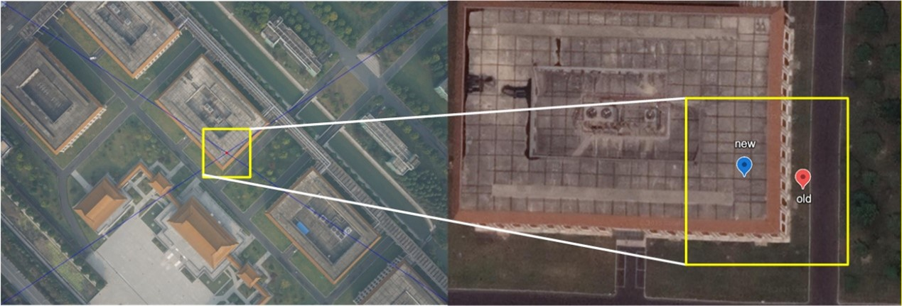
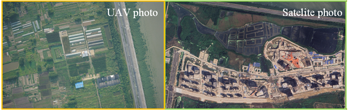
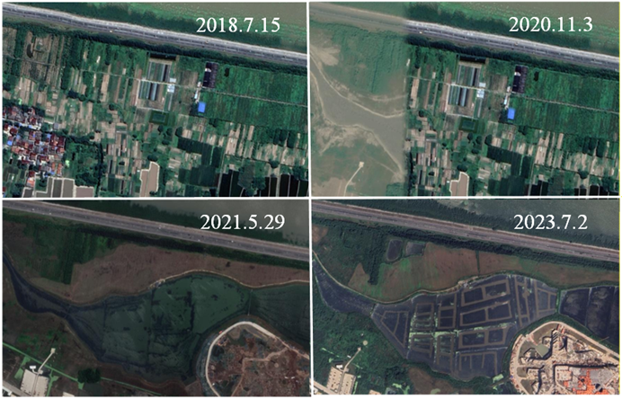
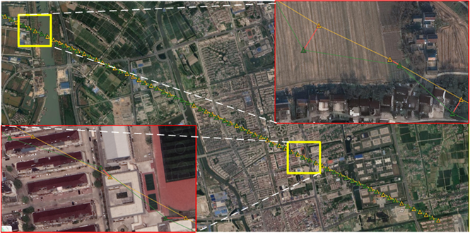
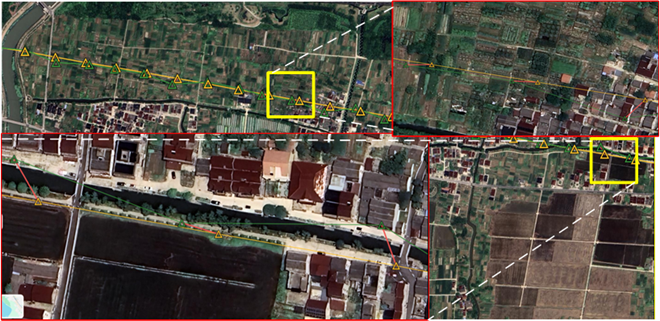
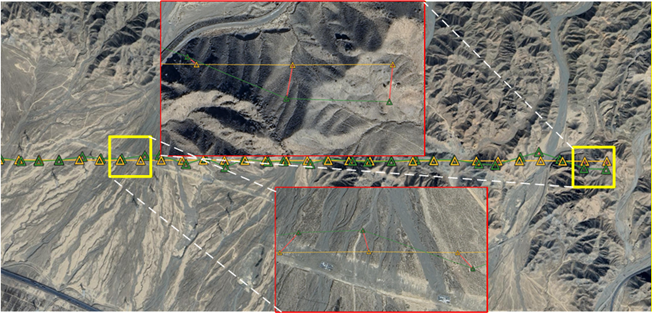
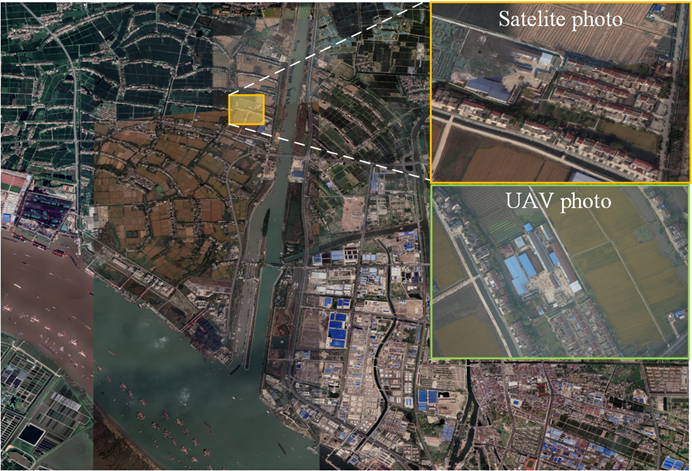
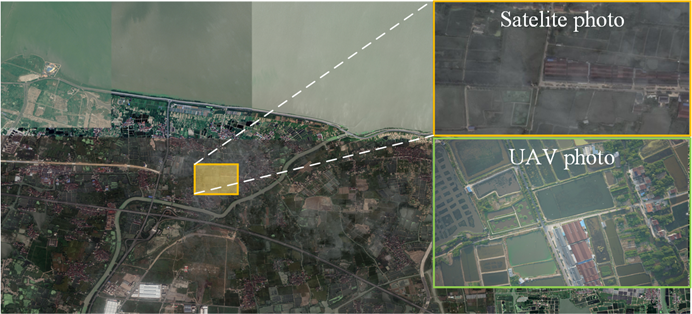
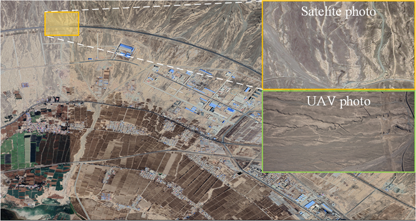
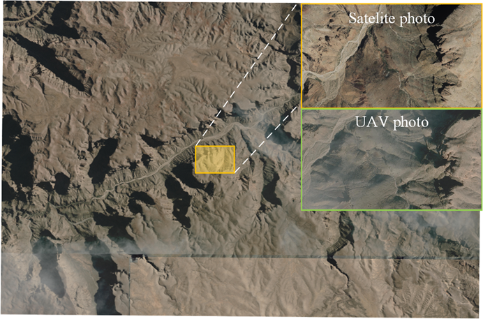

**A Dataset for UAV Visual Localization**

**1. Related works**

In recent years, with the rapid advancement of science and technology, unmanned aerial vehicles (UAVs) have been increasingly adopted across military, agricultural, and industrial applications. Among the key technologies enabling UAV autonomy, navigation and localization systems play a central role. Currently, UAV positioning typically relies on Global Navigation Satellite Systems (GNSS). However, in real-world missions, UAVs often operate in challenging environments—such as urban canyons, conflict zones, and mountainous or forested areas—where GNSS signals are vulnerable to occlusion (by buildings or vegetation), multipath effects, and deliberate interference, thereby severely compromising operational safety and mission reliability. For example, during the 2020 Nagorno-Karabakh conflict, GNSS outages were reported to be associated with UAV mission failure rates as high as 37%. Consequently, achieving reliable UAV localization in GNSS-denied environments has become a pressing and critical challenge.

Against this background, various localization approaches have been proposed, including vision-based methods, inertial navigation, and multi-sensor fusion. Among them, vision-based localization has attracted increasing attention due to its relatively low cost and potential for high accuracy in well-lit, texture-rich environments. These methods extract and match image features to enable reliable UAV positioning in GNSS-denied environments. Furthermore, vision-based absolute localization for UAVs registers onboard imagery to reference geospatial data, such as satellite imagery, to obtain absolute position estimates. This approach mitigates cumulative drift and shows strong promise for future development.

However, the performance of vision-based localization depends heavily on the visual consistency between aerial images and georeferenced satellite imagery. Owing to the high cost and limited accessibility of synchronized data collection, most studies rely on publicly available satellite imagery sources, such as Google Earth. In practice, UAV imagery and satellite imagery are often collected at different times, resulting in substantial mismatches in appearance during image matching, including seasonal changes, illumination differences, and other domain-specific variations.

**2. Existing Problems**

In our UAV vision-based localization research, we use the public UAV-VisLoc dataset as a benchmark. Released by Xu W, this dataset contains UAV images and georeferenced satellite imagery collected from real-world environments, covering diverse regions and terrain types. We thank Xu W for making this open-source dataset available, which has greatly facilitated and supported our UAV vision localization research.

However, during our experiments, we found several issues in the dataset. First, the annotated center coordinates (latitude and longitude) of the UAV images are offset from the true image centers, with non-negligible deviations (Fig. 1). Second, due to temporal misalignment between UAV and satellite data, noticeable scene and land-cover changes are present (Fig. 2). As a result, corresponding features between UAV and satellite images show poor consistency, which significantly degrades the accuracy of vision-based localization.

Figure 1. Comparison of positions before and after calibration (offset 17 meters)

Figure 2. Comparison of images from the same location in the dataset

We attribute these issues to the following factors. For the positional reference of UAV imagery, author primarily uses the planned flight trajectories as a proxy for ground truth. In practice, however, UAVs are subject to wind disturbances during flight, which causes deviations from the preplanned paths and results in non-negligible positional errors.

Regarding scene inconsistency, rapid urbanization and land-use changes in recent years have substantially altered local landscapes. For example, in the Huzhou subset, UAV images were captured in June 2019, whereas the satellite images were acquired in July 2023. This four-year temporal gap leads to noticeable scene and land-cover changes (Fig. 3). Moreover, satellite imagery of the same location can vary significantly over time; in particular, the image dated November 3, 2020 exhibits obvious mosaicking artifacts, likely due to Google Earth stitching satellite tiles from different regions.

Figure 3. Satellite images from different times on Google Earth

**3. Contributions**

Considering the impact of the aforementioned issues on UAV vision localization testing, which cannot be ignored, our laboratory refined the dataset accordingly. To mitigate errors in the positional ground truth, we treat the image center as a proxy for the UAV position at the time of capture. After annotating the centers of the UAV images, and since the satellite imagery is sourced from Google Earth, we manually corrected the positional annotations associated with the image centers in the UAV-VisLoc dataset released by Xu W. Specifically, we identified nearby landmarks along the flight path close to each image center and adjusted the reference positions accordingly. Representative examples before and after correction are presented in Fig. 4 (regions A, B, and C). This manual refinement is time-consuming, and we placed the corrected annotations as close as possible to the image centers to support subsequent UAV vision-based localization evaluation.

Through this manual annotation, our laboratory identified 9 flight paths across 3 regions, covering various terrain features such as rural areas, fields, and urban environments. In addition, we created a virtual simulation scenario, which yielded 3 UAV flight paths with no errors in the UAV's reference position. In summary, the UAV vision absolute localization dataset consists of the following: Dataset Set-A, Set-B, and Set-C represent real UAV flight scenarios, while Set-D is a simulated dataset constructed by Yupeng Di. The dataset covers 4 regions and 12 flight paths, with a total flight distance of 104,498 meters.

（a）

（b）

（c）

Figure 4. Comparison of trajectories before and after calibration on Google Maps (yellow and green represent pre- and post-calibration, respectively)

---

**4. Dataset Details and Parameters**

|               |              |              |     |                                 |                                         |             |             |               |
| ------------- | ------------ | ------------ | --- | ------------------------------- | --------------------------------------- | ----------- | ----------- | ------------- |
| Trajectory    | Drone Images | Distance (m) | Set | Location                        | Scene                                   | Altitude(m) | Flight date | Satelite date |
| Trajectory 1  | 90           | 8441         | A   | Taizhou City, China             | Plain (including fields and city areas) | 466         | 2018.10     | 2021.4        |
| Trajectory 2  | 90           | 8407         | A   | Taizhou City, China             | Plain (including fields and city areas) | 466         | 2018.10     | 2021.4        |
| Trajectory 3  | 90           | 8445         | A   | Taizhou City, China             | Plain (including fields and city areas) | 466         | 2018.10     | 2021.4        |
| Trajectory 4  | 90           | 8884         | B   | Huzhou City, China              | Plain (including farmland and town)     | 551         | 2019.6      | 2018.4        |
| Trajectory 5  | 94           | 9277         | B   | Huzhou City, China              | Plain (including farmland and town)     | 551         | 2019.6      | 2018.4        |
| Trajectory 6  | 105          | 10360        | B   | Huzhou City, China              | Plain (including farmland and town)     | 551         | 2019.6      | 2018.4        |
| Trajectory 7  | 49           | 6256         | C   | Danshan City, China             | Wind-erosion landform                   | 2573        | 2023.10     | 2021.3        |
| Trajectory 8  | 49           | 6225         | C   | Danshan City, China             | Wind-erosion landform                   | 2573        | 2023.10     | 2021.3        |
| Trajectory 9  | 48           | 6132         | C   | Danshan City, China             | Wind-erosion landform                   | 2573        | 2023.10     | 2021.3        |
| Trajectory 10 | 90           | 11128        | D   | State of Arizona, United States | Canyon                                  | 2200        | 2022.4      | 2020.2        |
| Trajectory 11 | 70           | 8269         | D   | State of Arizona, United States | Canyon                                  | 2200        | 2022.4      | 2020.2        |
| Trajectory 12 | 110          | 12382        | D   | State of Arizona, United States | Canyon                                  | 2200        | 2022.4      | 2020.2        |


（a）

（b）

（c）

Figure 5. Zoomed-in and comparison view of the dataset

---

**5. Dataset Organization**
├────── Sec-A
│      ├────── Tra.1                        /* Drone Images
│      │      ├────── 03_0001.JPG
│      │      ├────── 03_0002.JPG
│      │      ├────── 03_0003.JPG
│      │      ├────── ..
│      │      └────── Tra1.csv              /* format as: filename latitude longitude
│      ├────── Tra.2
│      │      ├────── 03_0001.JPG
│      │      ├────── 03_0002.JPG
│      │      ├────── 03_0003.JPG
│      │      ├────── ..
│      │      └────── Tra2.csv
│      ├────── Tra.3
│      │      ├────── 03_0001.JPG
│      │      ├────── 03_0002.JPG
│      │      ├────── 03_0003.JPG
│      │      ├────── ..
│      │      └────── Tra3.csv
│      ├────── satellite-A.tif                 /* Satellite Maps
│      └────── satellite-A.txt                 /* Satellite Maps latitude longitude
├────── Sec-B
│      ├────── Tra.4
│      │      ├────── 03_0001.JPG
│      │      ├────── 03_0002.JPG
│      │      ├────── 03_0003.JPG
│      │      ├────── ..
│      │      └────── Tra4.csv
│      ├────── Tra.5

---

**6.Download Link**

you can download it form 
https://1drv.ms/u/c/40d881ddc464ca14/IQCdyW_q_UzwS7P0xI3L_keTARJ18NLjOSf3Hlx9YghXIPs

**7.Attribution**
If you find our work useful we'd love to hear from you. If you use this repositorty as part of your research can you please cite the repository in your work:

```
@misc{FW-AirSim,
  author = {LHY},
  title = {VistaLoc-Set},
  year = {2025},
  publisher = {GitHub},
  journal = {GitHub repository},
  howpublished = {\url{https://github.com/Sea-hy/VistaLoc-Set}}
}
```

Thank you!